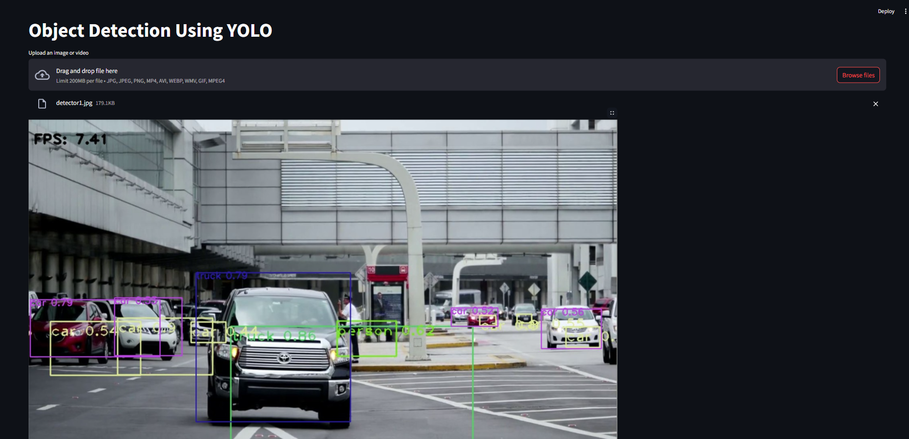

# 🔍 YOLOv3-Tiny Object Detection App (with Streamlit)

This repository contains a simple yet powerful **object detection web app** using **YOLOv3-Tiny** and **Streamlit**. It allows users to upload images, videos, and even GIFs to detect and label objects in real-time using the pre-trained YOLOv3-Tiny model.

## 🚀 Features

- 🔍 **Real-time object detection** on:
  - 📷 Images (`.jpg`, `.png`, etc.)
  - 🎞 Videos (`.mp4`, `.avi`, `.wmv`, etc.)
  - 🌀 GIF animations (`.gif`)
- 🧠 **YOLOv3-Tiny** pre-trained on **COCO dataset**
- 💬 Bounding boxes with class labels and confidence scores
- 🖥 Enlarged display (1.5x) for better visibility
- 📊 FPS counter for videos

## 🧰 Technologies Used

- [Python 3.8+](https://www.python.org/)
- [OpenCV](https://opencv.org/)
- [NumPy](https://numpy.org/)
- [Streamlit](https://streamlit.io/)
- [Pillow (PIL)](https://python-pillow.org/)

## 📁 File Structure

 ├── yolov3-tiny.cfg # YOLOv3-tiny configuration
 
 ├── yolov3-tiny.weights # Pretrained weights
 
 ├── coco.names # List of COCO class names
 
 ├── real_time_yolo_detector.py # Streamlit application file
 
 ├── sample/ # Folder for sample images/videos/GIFs
 
 └── README.md # Project documentation

 
## 📥 Download YOLOv3-Tiny.Weights

https://huggingface.co/spaces/VipulS/Ytest/resolve/main/yolov3-tiny.weights

## ▶️ Run the App
### Bash
 
   -streamlit run app.py 
 
   -Then open the URL provided (usually http://localhost:8501) in your browser.

## 📸 How It Works
 - Upload an image, video, or GIF
 - The app:
   - Reads and preprocesses each frame
   - Passes the frame to YOLOv3-tiny
   - Draws bounding boxes and labels on detected objects
   - Displays the processed output in real-time

## 📷 Sample Output
Upload an image/video/GIF and get object detections like this:

